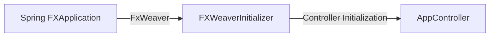
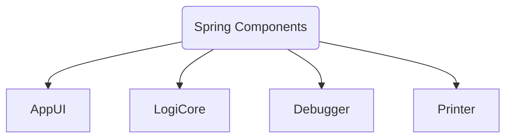
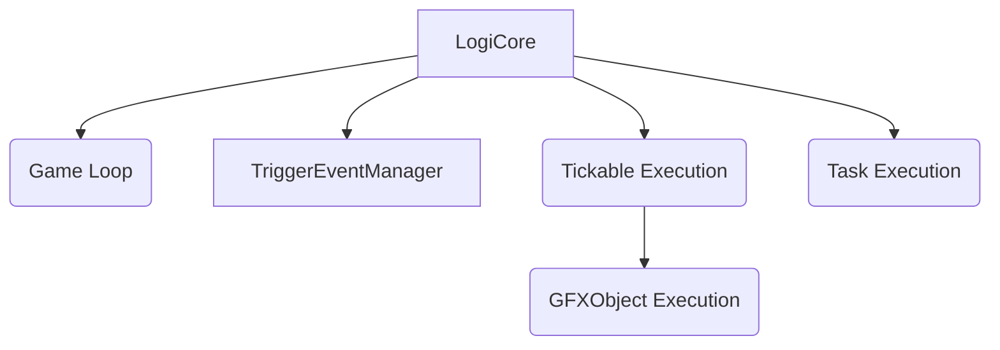

_IN PROGRESS_

# Tacository

The Tacository offers a variety of abstract modular frameworks that together form a fully-functional, dynamic, modular application.

## Overview

> The Tacository is a modular JavaFX framework designed to work with internal logic modules.
>
> At the most basic level, the Tacository Framework uses a `ContentManager` instance to help switch between any number of `Content` implementations.
>
> More detailed information can be found in Javadocs.

## Modules

### Foundation Modules

> Foundational modules are components of the Tacository framework that apply to every `Content` implementation.

#### Sidebar

> The `Sidebar` is the collapsable area located to the far-right of the application window.

> The `Sidebar` comprises a `List` of `UIBookshelf` objects.
> 1. Each `UIBookshelf` instance comprises an additional `List` of `UIBook` objects.

> The `Sidebar` contains 2 scopes of `UIBookshelf`: _Application Scope_ and _Content Scope_.
> 1. **Application Scope:** `UIBookshelves` that apply to every type of Content and are always available and visible, regardless of the active `Content`.
> 2. **Content Scope:** `UIBookshelves` that apply only to a specific type of Content and are only available and visible when the owning `Content` is active.

> The `SidebarBookshelf` implementation of `UIBookshelf` offers additional features specifically designed to work with the `Sidebar` root.

##### UIBookshelf

> The `UIBookshelf` defines the contents of each `Sidebar` group tab, comprised of `UIBook` objects.

##### UIBook

> The `UIBook` defines the contents of each sub-tab of a `UIBookshelf` instance.

##### UIPage

> Each `UIBook` is defined by one or more `UIPage` instances.
> 
> The `Sidebar` framework allows a `UIBook` to turn to any number of pages, with a framework-integrated back button appearing upon a page turn, permitting the user to turn back to the previous page.

#### LogiCore

> The `LogiCore` is a singleton Spring-managed object that handles the task execution and logic for the Tacository application.

##### Tickable

> The `Tickable` interface provides the backbone of logic execution.  
> The `Tickable` interface offers one abstract method, `taskManager()`.
> 
> The `taskManager()` method supplies a `TaskManager` instance that handles the logic of the `Tickable` implementation.

> _See `TaskManager` documentation for additional information._


##### TaskManager

> The `TaskManager` class handles the logic execution for a `Tickable` object.
> 
> The `TaskManager` is powered primarily by `GameTask` objects.

> _See `TaskManager` documentation for additional information._


##### GFXObject

> The `GFXObject` implementation of `Tickable` offers several additional abstract methods for handling `JavaFX Operations`.


##### GameTask

> `GameTask` offers a variety of abstract members for creating any type of task to be executed by a `TaskManager`.  

> _See `TaskManager` documentation for additional information._


#### JSON Framework


#### Content

> The `Content` is the backbone of the Tacository framework, defining the specifics of a Tacository application.

####  

### Flow Models

##### Spring Initialization



#### Spring Components



#### LogiCore Flow



#### AppUI Flow

```mermaid

graph TB

AUI[AppUI]

SB[Sidebar]
AC[AppController]
CM[ContentManager]
IH(Input Handling)

SBI(Sidebar Initialization)

C[Content]
CD[ContentData]
CC[ContentController]
CCTM[TaskManager]
CB[Content Bookshelves]
IHI(Input Handling Implementation)
OH[OverlayHandler]

UIBS[UIBookshelf]
UIBK[UIBook]
UIPG[UIPage]
UIPH[UIPageHandler]
SBBS[SidebarBookshelf]


AUI --> SB
AUI --> AC
AUI --> IH
AUI --> CM

AC --> SBI

SB --> UIBS
UIBS --> SBBS
UIBS --> UIBK
UIBK --> UIPG
UIPG --> UIPH

CM --> C
C --> CD
C ---> CC
C --> CB
C ---> IHI
C --> OH

CC --> CCTM
