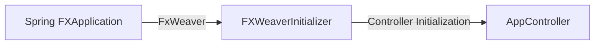
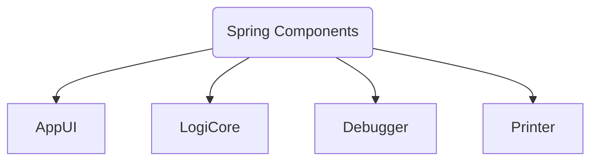
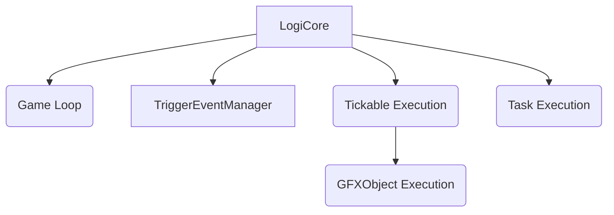

_IN PROGRESS_

# Tacository

The Tacository offers a variety of abstract modular frameworks that together form a fully-functional, dynamic, modular application.

## 1 Overview

> The Tacository is a modular JavaFX framework designed to work with internal logic modules.
>
> At the most basic level, the Tacository Framework uses a `ContentManager` instance to help switch between any number of `Content` implementations.
>
> More detailed information can be found in Javadocs.

## 2 Modules

### [2.1] Foundation Modules

> Foundational modules are components of the Tacository framework that apply to every `Content` implementation.

#### [2.1.1] Sidebar

> The `Sidebar` is the collapsable area located to the far-right of the application window.

> The `Sidebar` comprises a `List` of `UIBookshelf` objects.
> 1. Each `UIBookshelf` instance comprises an additional `List` of `UIBook` objects.

> The `Sidebar` contains 2 scopes of `UIBookshelf`: _Application Scope_ and _Content Scope_.
> 1. **Application Scope:** `UIBookshelves` that apply to every type of Content and are always available and visible, regardless of the active `Content`.
> 2. **Content Scope:** `UIBookshelves` that apply only to a specific type of Content and are only available and visible when the owning `Content` is active.

> The `SidebarBookshelf` implementation of `UIBookshelf` offers additional features specifically designed to work with the `Sidebar` root.

##### [2.1.1.1] UIBookshelf

> The `UIBookshelf` defines the contents of each `Sidebar` group tab, comprised of `UIBook` objects.

##### [2.1.1.2] UIBook

> The `UIBook` defines the contents of each sub-tab of a `UIBookshelf` instance.

##### [2.1.1.3] UIPage

> Each `UIBook` is defined by one or more `UIPage` instances.
>
> The `Sidebar` framework allows a `UIBook` to turn to any number of pages, with a framework-integrated back button appearing upon a page turn, permitting the user to turn back to the previous page.

#### [2.1.2] LogiCore

> The `LogiCore` is a singleton Spring-managed object that handles the task execution and logic for the Tacository application.

##### [2.1.2.1] Tickable

> The `Tickable` interface provides the backbone of logic execution.  
> The `Tickable` interface offers one abstract method, `taskManager()`.
>
> The `taskManager()` method supplies a `TaskManager` instance that handles the logic of the `Tickable` implementation.

> _See `TaskManager` documentation for details and additional information._

##### [2.1.2.2] TaskManager

> The `TaskManager` class handles the logic execution for a `Tickable` object.
>
> The `TaskManager` is powered primarily by `GameTask` objects.

> _See `TaskManager` documentation for details and additional information._

##### [2.1.2.3] GFXObject

> The `GFXObject` implementation of `Tickable` offers several additional abstract methods for handling `JavaFX Operations`.

##### [2.1.2.4] GameTask

> `GameTask` offers a variety of abstract members for creating any type of task to be executed by a `TaskManager`.

> _See `TaskManager` documentation for details and additional information._

#### [2.1.3] JSON Framework

> The JSON Frameworks offers streamlined JSON saving and loading support.

> _See `JElement`, `JLoadable`, and `JLoadableObject` documentation for details and additional information._

##### [2.1.3.1] JElement

> The `JElement` interface defines implementing objects as being a JSON component.

> _See `JElement`, `JLoadable`, and `JLoadableObject` documentation for details and additional information._

###### [2.1.3.1.1] JObject

> The `JObject` extension of `JElement` offers support for converting any implementing class to a `JsonObject`.
>
> `JObject` is, in essence, the backbone of saving a `JElement`

> _See `JElement`, `JLoadable`, and `JLoadableObject` documentation for details and additional information._

##### [2.1.3.2] JLoadable

> The `JLoadable` interface is the backbone for loading a `JLoadable` implementation from a previously-saved JSON file.

> _See `JElement`, `JLoadable`, and `JLoadableObject` documentation for details and additional information._

###### [2.1.3.2.1] JLoadableObject

> The `JLoadableObject` extension of `JLoadable` is very similar to the standard `JLoadable` interface.  
> However, unlike `JLoadable`, `JLoadableObject` automatically processes the `JID` as a JSON element.

> _See `JElement`, `JLoadable`, and `JLoadableObject` documentation for details and additional information._

##### [2.1.3.3] JUtil

> `JUtil` provides backbone, convenient factory and utility methods for working with JSON Files.

> _See `JElement`, `JLoadable`, and `JLoadableObject` documentation for details and additional information._

##### [2.1.3.4] JFiles

> `JFiles` provides backbone, convenient methods for working directly with JSON files.
>
> In essence, `JFiles` contains methods for using the JSON Framework components as outlined above.

> _See `JElement`, `JLoadable`, and `JLoadableObject` documentation for details and additional information._

#### [2.1.4] Content

> The `Content` is the backbone of the Tacository framework, defining the specifics of a Tacository application.

### [2.2] Graphics

> The Tacository framework depends on `JavaFX`, `Spring`, and `FxWeaver` libraries.

#### [2.2.1] ListView Framework

> The `ListView Framework` defines a variety of classes that together help define the function, behavior, and appearance of a `ListView` or `TreeView` component.

#### [2.2.2] IndexedCellFXable

> The `IndexedCellFXable` interface provides the backbone for both `ListCellFX` and `TreeCellFX`.

##### [2.2.2.1] ListCellFX

> `ListCellFX` is an extension of `ListCell` that is designed to work with the `ListView Framework`.
>
> To use a `ListCellFX`, simply pass the `ListCellFX` as a `Function` to the `listViewInstance.setCellFactory(listCellFxFunction);`.
>
> New `ListCellFX` instances are often constructed as in-line anonymous classes.

###### Example Implementation

```java
public class AttributePageController {
    
    //...//
    
    @Override
    public void initialize() {
        attributeListView.setCellFactory(listView -> new ListCellFX<>( //Define a Function that returns a new ListCellFX instance.
                listCellFX -> new CellControlManager<>( //Define the CellControlManager factory Function passed to the ListCellFX constructor.
                        listCellFX, //Pass the resulting ListCellFX instance to the CellControlManager constructor.
                        cellData -> Stuff.get( //Define the CellController implementation, often constructed directly from the Springable.weaver() function.
                                cellData, //Pass the CellData Function input value as the Lookup Key parameter for the Stuff.get(...) static util accessor method.
                                () -> weaver().loadController(AttributeElementController.class), //Define the CellController factory Function, typically a Spring-Managed, FxWeaver-Managed, prototype Spring Component.
                                listView.hashCode())))); // Pass the ListView hash code as a Stuff.get(...) optional params input.
        
        //...//
    }
    
    //...//
}
```

##### [2.2.2.2] TreeCellFX

> `TreeCellFX` is an extension of `TreeCell` that is designed to work with the `ListView Framework`.  
> `TreeCellFX` is identical to `ListCellFX` except `TreeCellFX` manages a `TreeCell` member of a `TreeView` whereas `ListCellFX` manages a `ListCell` member of a `ListView`.
> 
> However, due to the hierarchical nature of a `TreeView`, the `ListView Framework` offers additional control over `TreeView` functionality.


###### [2.2.2.2.1] TreeLoader

> The `TreeLoader` is used to provide in-depth control over the hierarchical components of a `TreeView`.


###### [2.2.2.2.2] WrappingTreeLoader

> `WrappingTreeLoader` offers a non-abstract extension of `TreeLoader`.
> 
> Unlike `TreeLoader`, `WrappingTreeLoader` provides a default `TreeLoader.createTreeCellData(...)` implementation that automatically constructs a new `WrappingTreeCell` instance based on the input parameters.

###### [2.2.2.2.3] TreeCellData

> The `TreeCellData` class represents a `TreeView` element.
> 
> To define a `TreeCellData` instance, override the abstract `TreeCellData.createWrappedInstance(...)` method.


###### [2.2.2.2.4] WrappingTreeCellData

> `WrappingTreeCellData` offers a non-abstract extension of `TreeCellData`.
> 
> `WrappingTreeCellData` is designed to work seamlessly with a `WrappingTreeLoader` object.


##### [2.2.2.3] CellControlManager

> The `CellControlManager` functions as the backbone of the `ListView Framework`.
>
> The `CellControlManager` is passed to a `TreeCellFX` or `ListCellFX` constructor as a `Factory Function`.

> _See `CellControlManager` documentation for details and additional information._

#### [2.2.3] Paintable Framework

#### [2.2.4] Dialog Framework

#### [2.2.5] ContentController Framework

#### [2.2.6] Shapes

#### [2.2.7] Drag and Drop Framework

#### [2.2.8] ImageButton Framework

### [2.3] Flow Models

#### [2.3.1] Spring

##### [2.3.1.1] Spring Initialization



##### Spring Components



#### LogiCore Flow



#### AppUI Flow

```mermaid

graph TB

AUI[AppUI]

SB[Sidebar]
AC[AppController]
CM[ContentManager]
IH(Input Handling)

SBI(Sidebar Initialization)

C[Content]
CD[ContentData]
CC[ContentController]
CCTM[TaskManager]
CB[Content Bookshelves]
IHI(Input Handling Implementation)
OH[OverlayHandler]

UIBS[UIBookshelf]
UIBK[UIBook]
UIPG[UIPage]
UIPH[UIPageHandler]
SBBS[SidebarBookshelf]


AUI --> SB
AUI --> AC
AUI --> IH
AUI --> CM

AC --> SBI

SB --> UIBS
UIBS --> SBBS
UIBS --> UIBK
UIBK --> UIPG
UIPG --> UIPH

CM --> C
C --> CD
C ---> CC
C --> CB
C ---> IHI
C --> OH

CC --> CCTM
